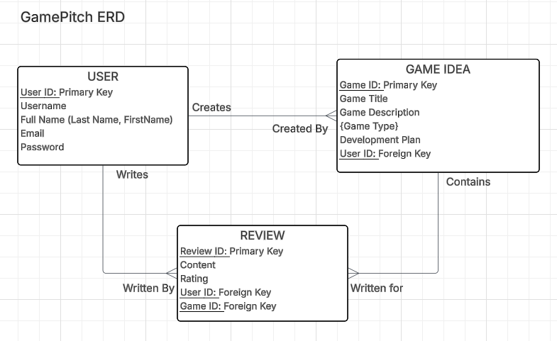

# GamePitch - Video Game Design Document Hub

GamePitch is a platform designed for independent game developers and hobbyists to brainstorm, document, and share their game concepts. The platform acts as a centralized repository for lightweight Game Design Documents (GDDs), allowing creators to organize their ideas and receive structured feedback from a community of fellow developers.

## Core Purpose
The main purpose of GamePitch is to solve the "scattered ideas" problem that many developers face. Instead of losing game concepts to random notebooks, text files, or discord messages, users can have a dedicated, structured workspace to plan and fully flesh out game mechanics and loops. It also serves as a testing ground to pitch ideas to a community of developers before investing months into actual development.

##  The Intended User
* **Independent Game Developers:** Looking for a clean space to brainstorm and log active or future projects.
* **Hobbyists & Designers:** Wanting to map out game systems, as well as game loops.
* **Collaborators & Peer Reviewers:** Interested in reading game pitches and offering feedback on mechanics.

---

## Entity Relationship Diagram (ERD)

---
## Technical Setup Instructions

### Prerequisites:
Ensure you have Node.js installed on your local machine.

### 1. Clone this Repository

### 2. Create a .env file locally, include this code:
PORT=3000

dbURL=mongodb+srv://<username>:<password>@cluster0.xxxxxx.mongodb.net/your_database_name

### 3. Install Dependencies:
Run npm install from root folder.

### 4. Run With npm run dev
backend will run on http://localhost:3000

the vite dev server will run on http://localhost:5173

### Enjoy, and Happy Pitching!
